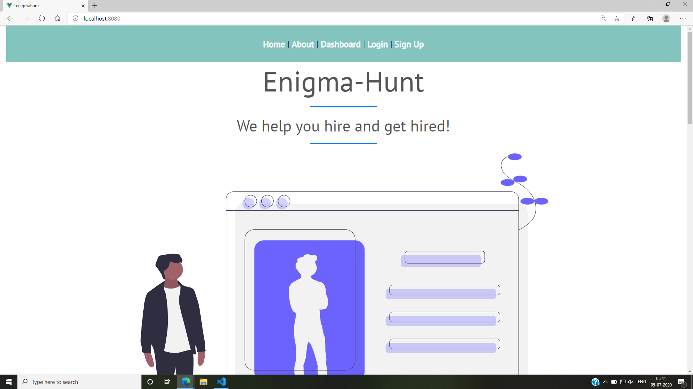
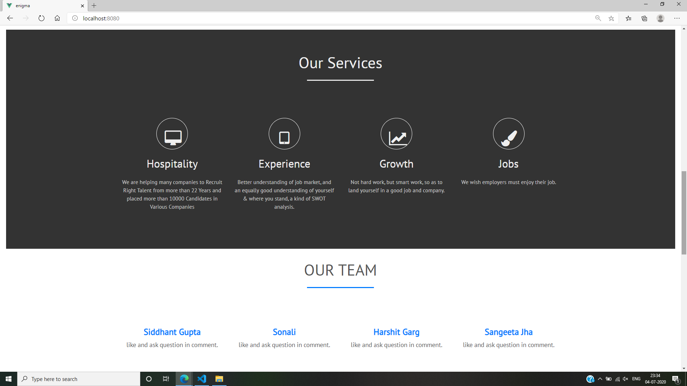

# Enigma-Hunt
[http://enigma-hunt.web.app/](http://enigma-hunt.web.app/)

## Screenshots


.png)
.png)

## Demo
[Demo](https://drive.google.com/file/d/1kyViyt8lrga67ARQSWJwd2pV8VoT27o2/view?usp=sharing)

## Technologies Used
- Vue JS
- Firebase


## Project setup
```
npm install
```

### Compiles and hot-reloads for development
```
npm run serve
```

### Compiles and minifies for production
```
npm run build
```

### Customize configuration
See [Configuration Reference](https://cli.vuejs.org/config/).
